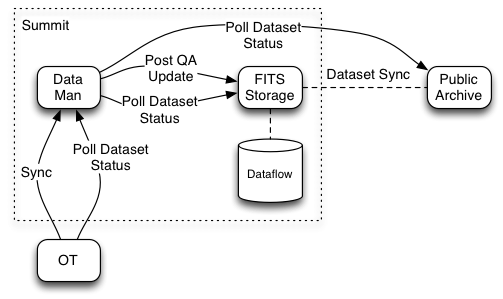

# Data Manager

The Data Manager service runs as part of the Observing Database at each summit, interacting with
the Gemini archive and FITS storage servers to report dataset status and synchronize QA state.  This
document provides a user-focused look at what the Data Manager does and how it works, and provides
insight into understanding the status messages that are presented in the OT.

## Overview

To understand the Data Manager, it is helpful to put it in context with the FITS storage server,
public archive and Observing Tool.  The picture below represents the software systems involved and
their interactions at a basic level.

The Data Manager is colocated with the Observing Database so it can easily read and update any
program.  It is charged with keeping the QA state in sync between ODB records and summit storage.
This is important because QA state plays a role in time accounting, the results of which are
presented in both the Observing Tool and various reports.

The FITS storage server handles all interactions with the FITS files themselves.  It keeps the
FITS files on disk in sync with its own internal representation and maintains the dataset in sync
with the version available in the public archive.  It is important to underscore the difference
between the FITS file itself and the record of it maintained in the FITS storage server.  The two
can be momentarily out of sync while the storage server is busy handling an update.  This topic
comes up again in the following discussion of QA state updates and when detailing the status
messages displayed in the Observing Log UI.

Finally the OT presents a user interface that reveals the current status of datasets in the system
and allows the user to update the QA state.  The OT communicates with the ODB / Data Manager
directly and leaves database record maintenance to the Data Manager.

### Updating QA State

There are two ways that a user can modify QA states:

1. Use the OT and its Observing Log GUI.
2. Work directly with FITS files in the summit storage system.

We'll cover the second alternative below in the discussion on polling.  Using the Observing Log GUI
in the OT works just like updating anything else in the science program.  Namely, the user edits the
QA state by selecting the desired value in the provided widget and then stores the change in the
ODB via the program synchronization feature.  Until changes are synchronized with the database,
they will not be forwarded on to the FITS Storage server.

The Data Manager monitors the ODB for updates to QA state.  When it detects a change, it posts
a corresponding request to the FITS storage server.  The storage server in turn immediately accepts
the request and updates the dataset file on disk, or else responds with an error.  Acceptance of an
update request is a promise on the part of the storage server to eventually update its internal
records to match.  Until that promise is fulfilled, a query for the current QA state of the
dataset will continue to report the value it had *before* the update took place.  Presumably at
some later point, the storage server records are updated and the modified dataset is forwarded on to
the public archive.  Throughout the process, the Data Manager keeps the dataflow status up-to-date
in the database.

### Polling

Neither the Data Manager nor the FITS storage server provide events when dataset records are
updated.  For this reason, current dataset status is always updated via polling.  The Data Manager
polls the storage server and applies any necessary changes to ODB records.  The OT polls the
current dataset status in the database and updates the local copy of the program that it is
editing.

In the OT, the poll period depends upon user privileges and whether the program is currently being
displayed in an OT window.  In particular the polling rates are:

<table>
  <caption>OT/ODB Poll Periods</caption>
  <tr><th>Displayed?</th><th>Privileges</th><th>Poll Period</th></tr>
  <tr><td>Yes</td><td>Staff</td><td>10 seconds</td></tr>
  <tr><td>Yes</td><td>Non-Staff</td><td>1 hour</td></tr>
  <tr><td>No</td><td>Staff</td><td>5 minutes</td></tr>
  <tr><td>No</td><td>Non-Staff</td><td>1 day</td></tr>
</table>

Displayed means that the program is open and visible in an OT window, not just loaded in its
history or available in a local copy.

To keep the network load to a minimum, the OT transmits a hash of the expected poll results.
The ODB checks the hash against the current poll results and if nothing has changed, returns
a minimal result.

The Data Manager polls both the local FITS storage server and the public archive for dataset status
information. Like the OT, the poll period is variable.  The polling rates are:

<table>
  <caption>Data Manager Poll Periods</caption>
  <tr><th>Category</th><th>Poll Period</th></tr>
  <tr><td>Tonight's Datasets (Archive)</td><td>1 minute</td></tr>
  <tr><td>Tonight's Datasets (Summit)</td><td>15 seconds</td></tr>
  <tr><td>This Week's Datasets</td><td>15 minutes</td></tr>
  <tr><td>All Datasets</td><td>1 day</td></tr>
  <tr><td>Pending Updates</td><td>2 minutes</td></tr>
</table>

The polling rates are somewhat arbitrary but configurable in case they prove to be inadequate.
For the purposes of polling "tonight" is defined as the current observing night which begins at
2PM local time.  This "week" is a period of 7 observing nights.  All datasets are updated on a
daily basis but one program at a time.  That is, one query per program.

Finally, the Data Manager makes a periodic sweep of all the observations in the ODB looking for
any with a dataset whose status is expected to change soon.  For all of these, it requests
updates from the summit storage service and public archive.  A dataset is "expected to change
soon" if its QA state is in the process of updating, or if the summit and public versions differ.
This feature covers QA state updates initiated from the OT for older datasets not included in the
nightly or weekly polls.

>  It is assumed that the archive will never cut off the results for a poll
query, even if the response is large, because otherwise the Data Manager will believe that the
datasets that do not appear in the results are simply not present in the remote server.

As mentioned in the previous section, a user might directly edit the FITS header of a dataset
on disk.  In this case, the FITS storage server will notice, update its records, and the Data
Manager will find out about the change in the next poll that includes the dataset.  From the
point of view of the Data Manager then, datasets can spontaneously change their QA state.

## Dataset Lifecycle and Dataflow Status

This section traces the typical lifecycle of a dataset at Gemini and indicates the corresponding
status displayed in a user's OT along the way.

#####  _Missing Dataset_

As soon as the seqexec sends an "end dataset" event to the ODB, a new dataset record is added to
the science program to record it.  Until the dataset has been verified by polling the FITS storage
server though, it is considered missing.  This is the dreaded "datasets are grey" status that often
appears in fault reports, but it is _normal_ for a dataset to be shown as missing for a short while
at the outset. Before it can transition to not missing, the dataset must first be:

* recognized by the storage server in the DHS directory
* copied to the dataflow directory
* entered into the FITS storage server database
* returned in Data Manager query results and updated in the ODB
* updated in the OT's copy of the program by polling or synchronizing with the ODB

>  While waiting, the user can still adventure a QA state setting.  Once
the dataset is finally recognized, if it still has an "Undefined" QA state in its FITS header, the
QA state setting applied in the OT will be used to update the dataset.

Finally, a dataset that is not in summit storage but is in the public archive is considered
"Archived", not "Missing".  "Archived" is the typical end-of-life status for old datasets that
have been deleted from the summit.

#####  Needs QA Evaluation

A freshly minted dataset starts with an "Undefined" QA state.  Once recognized in the summit FITS
storage server, a dataset without a definitive QA state appears in "Needs QA Evaluation" status.
(This will typically be the case though of course the QA state can be set directly in the dataset
file on the summit.)  A dataset in "Needs QA Evaluation" status may or may not be in the public
archive.

#####  QA Sync Pending

When a staff member sets the QA state to a value other than "Undefined", the dataset status is
immediately changed to "QA Sync Pending" in the Observing Tool copy of the program.  The update
must first be synchronized with the ODB before the Data Manager knows of it and can forward it
on to the archive system.  Even after the sync completes, there will be a short period during
which the dataset remains in this status. The Data Manager must recognize the update and
transition the status to "QA Update in Progress", and this change must be picked up by the OT
poll of the ODB.

#####  QA Update in Progress

When the Data Manager notices a changed QA state setting, it forwards the update request on to the
FITS storage server, which immediately accepts it or reports a failure if it cannot do so. At some
point in the future after the request completes, the FITS storage service's internal records are
updated to reflect the change.

Should the update request fail, the dataset status is immediately set to "QA Update Error".  If it
should succeed on the other hand, it remains in "QA Update in Progress" until a storage server poll
confirms an update to the dataset in its database.

>  Almost always the update will be a result of the QA update request that
was just initiated.  Nevertheless, _any update_ is considered to complete the request, whether or
not the dataset currently has the expected QA state.  This is because a user may also update QA
states directly in the FITS file at any time and the storage server provides no way of
distinguishing whether the OT user's original request was applied and subsequently overwritten or
is yet to be applied.

While in "QA Update in Progress" status additional detail is provided in the Observing Log GUI in
the OT.  It indicates the timestamp in UTC (according to the ODB machine's clock) at which the
dataset was last examined and what was happening at the time, which will be one of:

* Awaiting send to FITS Server
* Sending to FITS Server
* Accepted by FITS Server

Update attempts that end in failure are automatically retried, so the number of attempts are also
displayed in the detail message if this is the second or later try.

#####  QA Update Error

Hopefully "QA Update Error" will be a rare occurrence.  This status corresponds to a failure
report from the FITS storage server when a QA update was attempted.  The failure reported by the
storage server is presented in the "Detail" column in the OT Observing Log GUI along with the time
at which the problem occurred (according to the ODB machine's clock).

Update requests that end in failure are automatically retried until successful. The retry rate is
set to 15 minutes, but a dataset must have a failed state for at least a full minute before it is
retried.

#####  Not in Public Archive

A dataset "Not in Public Archive" is at least known to be in the summit server and the QA state is
in sync with the value recorded in the ODB.  Until the dataset is also publicly available though,
it will appear with this status.

#####  In Sync with Archive

When "In Sync with Archive", the ODB, summit storage, and public archive all agree on the QA state.
The FITS storage server and public archive house the same version of the FITS file.  This should be
the typical resting status of a relatively recent (last few semesters?) QA'ed dataset.

#####  Needs CS Evaluation

If the user selects a "Check" QA State, and this state is properly applied to the summit copy of
the dataset and has made its way into the FITS storage server database, the dataset appears in
"Needs CS Evaluation" status.  The FITS storage server should take care of notifying the contact
scientist of the "Check" request.

#####  Awaiting Archive Sync

"Awaiting Archive Sync" refers to a case in which the ODB and FITS storage server recognize the
same QA state, the dataset is known to be in the public archive, and yet the updated version has
not yet made its way to the public archive.  Presumably the two will be synchronized at some point
in the future.

#####  Archived

"Archived" is the typical end-of-life status for a dataset.  An archived dataset is in the public
archive but no longer on the summit.  QA state updates will have no effect in this status.

## Dataflow Status Rollup

The OT displays the "Dataflow Status" for an observation as a whole in the observation node UI.
The status it shows there will always be "No Data" or else one of the individual dataflow status
options detailed in the previous section.  The dataflow status value selected is the most important
status amongst all the observation's datasets according to the following priority order:

1. Missing Dataset
1. Needs CS Evaluation
1. Needs QA Evaluation
1. QA Sync Pending
1. QA Update Error
1. QA Update in Progress
1. Not in Public Archive
1. Awaiting Archive Sync
1. In Sync with Archive
1. Archived

## Data Manager Startup Corner Case

The Data Manager can be shutdown at any time, even if there are outstanding QA update requests
that have not been sent or have been sent but not yet completed.  At startup, the Data Manager
looks for any requests that were outstanding when last shutdown and marks them as "QA Update
Error" with an appropriate message.  These are then retried about 1 minute after the Data Manager
is back online.  (The one minute delay has to do with reusing the same retry mechanism as any
other failed QA update request, which stipulates that a delay of at least 1 minute is required
before a retry.)

>  Note that this could lead to unexpected results.  For example,
consider a situation in which the Data Manager is shutdown when there is an outstanding request
to set a QA state to PASS.  Now assume that while offline, someone decides that the dataset is
merely USABLE and updates the header directly with `hedit`.  Now the Data Manager is started and
immediately tries to update the QA state to PASS.

> A solution to this problem was identified but not implemented.  The idea is that the Data Manager
would send along the expected last modification time of the dataset when it makes a QA request.
The FITS storage server could then verify that the dataset has not been updated and apply the QA
update, or see that in fact the dataset is now newer than it was when the initial QA request was
made and reject the update.

