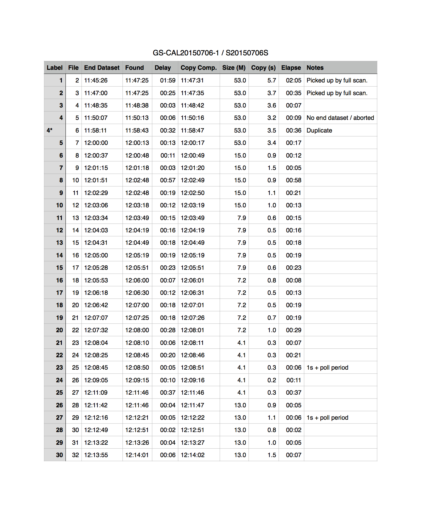

## Data Manager Testing Results

Notes and results from the Data Manager test session on July 6, 2015 at Gemini South.

### Notes on Raw File Copying

* Raw files are copied from the DHS directory to the "dataflow" directory in a temp file whose name is the same as the FITS file but with extension ".tmp".  Only when an MD5 checksum computed on the source FITS file and the temp file match is the `x.fits.tmp` file [renamed](https://github.com/gemini-hlsw/ocs/blob/develop/bundle/edu.gemini.dataman.app/src/main/java/edu/gemini/dataman/raw/RawCopier.java#L224-L226)  to `x.fits`.

* "dhs" directory polling is done in a separate timer task which runs in a separate thread and only worries about copying raw datasets to the working "dataflow" directory.  I had thought perhaps the limit of 10 worker threads which was introduced due to a limit on the number of remote connections accepted by the GSA base facility machines might be introducing a delay but that isn't the case.

* There is a full scan of all datasets in the "dhs" directory every 2 minutes.  There is also a smaller "active" scan of the expected next datasets every 5 seconds.  The first datasets of the night are picked up by full scan and subsequent ones should be found by the active scan.  In the Timing Results below, the first two datasets are discovered by the full scan and the subsequent datasets by the active scan.

* When it finds new datasets the copier will copy each one sequentially one after another.  For largeish datasets like the 53M 1x1 binning GMOS biases in the Timing Results, this can take a while (up to 6 seconds for the first dataset in the test results).  We might benefit with doing the copying in parallel.

### Timing Results

* It takes up to 25 seconds to do a full scan of the "dataflow" working directory looking for random new datasets but only a bit over 1 second to do a full scan of the "dhs" directory.  Of course it is the "active set" scan of expected next datasets we’re more concerned with.

* The copy time is quick once the dataset appears in the DHS directory.  When there is a delay much longer than the 5 second active set poll period, it is a delay waiting for the DHS to write the dataset to disk.

* _Label_ - Dataset Label as seen in the OT (prefixed with GS-CAL20150706-1-).

* _File_ - FITS file name (prefixed with S20150706S and with `.fits` suffix).

* _End Dataset_ - The time at which that the seqexec sends the end dataset event.

* _Found_ - When the poller first sees the file on disk in the dhs directory.

* _Delay_ - Time between End Dataset and Found. This is frequently an inexplicable delay waiting for the file to appear in the "dhs" directory.

* _Copy Comp._ - The timestamp logged when the file has been successfully copied from "dhs" to "dataflow".

* _Size_ - Size of the corresponding dataset in megabytes.

* _Copy_ - How long the copy takes, in seconds.

* _Elapse_ - Time between Dataset End event from seqexec and dataset appearance in "dataflow".  This includes whatever overhead is involved in having the DHS write the dataset to disk as well as the delay between poll periods and the copy time itself.

