# Science Program Synchronization

## Introduction

Science program merging refers to combining two independently edited versions
of a science program into a single version that takes into account any changes
made in either copy.  Synchronization is the process by which the updates in
a remote program copy are fetched, merged locally, and then any necessary
changes sent back to the remote ODB.  At the end of synchronization both the
local and remote copies have the same content.

This document provides a few notes on science program merging and
synchronization that may help when looking through the code. 


## Version Vectors and Lifespan IDs

A science program is modeled as a tree of program nodes. Changes to one part
of the tree made in a local copy of the program can often be combined with
independent changes to another part of the tree made in a remote copy.  In
order to decide which copy has newer information, we maintain a monotonically
increasing edit counter for each node and instance of the program.

Identifying an "instance of the program" in order to tie it with an edit
counter is the job of the "lifespan" id.  Each copy of a program comes with
a unique id known as the lifespan id.  It's called a lifespan id because it
comes into existence when the program is first added to a database and
corresponds only to that instance of the program.  Should the program later
be removed from the database and then subsequently replaced, a new lifespan
id is created.  The `LifespanId` class is basically a wrapper around a
standard Java `UUID`.

> **Implementation note.** `LifespanId` could be a value class but since it is
> used as the type of the key parameter to a `VersionVector` (see below) it
> would be instantiated anyway.

Each node in a science program is associated with a small map from `LifespanId`
to a counter representing the number of edits that have been made to the node
in that instance of the program.  This map is called `NodeVersions`, which is
a type alias defined as

````scala
    type NodeVersions = VersionVector[LifespanId, java.lang.Integer]
````

where `VersionVector` is basically a `Map` with some convenience for
incrementing the edit counters and synchronizing and comparing
`VersionVectors`.

An edit to either the node's "data object" or child list increments the counter
associated with the program instance's `LifespanId`.  The edit counter is never deleted even if the associated program instance is deleted and the counter is
never decreased.  When two programs are merged, their `NodeVersions` are also
merged to track that we have accounted for all changes in both sides.

### Comparing `NodeVersions`

Two `NodeVersions` instances for the same program node can be compared to
determine which one is newer relative to the other (if any).  More precisely,
a partial ordering between instances of `NodeVersions` is defined.  The
ordering can be determined if the two versions being compared are either the
same or else one contains all the entries of the other with the same or
greater edit counters.  Otherwise, the two `NodeVersions` cannot be directly
compared and are said to be conflicting.  To simplify all of this,
a `VersionComparison` trait with `Same`, `Newer`, `Older`, and `Conflicting`
case objects is provided.

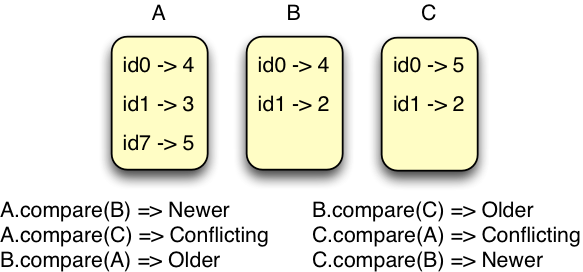

### Synchronizing `NodeVersions`

When two `NodeVersions` instances are synchronized the combined result has
the highest edit counter for all the entries in either side.  An example
should make this clear.

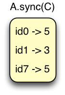

Incorporating the edit counters of one `NodeVersions` instance into another
in this way is done to indicate that all the changes in the corresponding nodes have been accounted for in the merged program node.


### `VersionMap`

If you take an entire program and create a `Map` of `Map`s, where the key is an
`SPNodeKey` and the values are `NodeVersions`, you get a `VersionMap` which is

````scala
    type VersionMap = Map[SPNodeKey, NodeVersions]
````

The `VersionMap` and its contained `NodeVersions` are integral to the merge
algorithm.


## Merge Plan

The `MergePlan` describes changes that may be applied to transform a
science program.  The differences contained in a remote version of a program
are fetched in a `MergePlan`. We use these differences and the content of the
local program to create a new `MergePlan` which can then be applied to update
both the local and remote programs.  The `MergePlan` includes a `Set` of
`Missing` elements and a `scalaz.Tree[MergeNode]`.

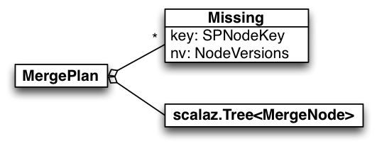

`Missing` elements track science program nodes that are not present in a
program, either because they have been deleted or because they have never
been added to a particular version.  The distinction between deleted vs
never-before-seen is important to the merge process so a science program
must maintain version information even for deleted nodes in its `VersionMap`.
If there is no entry for an `SPNodeKey` in the `VersionMap` we know that the
corresponding node is unknown to the program (as opposed to previously seen
but currently deleted).

The tree of `MergeNode`s describes changes to existing program nodes.  There
are two types of `MergeNode`, `Unmodified` and `Modified`.  `Unmodified`
identifies a science program node that should not be updated.  Unmodified
nodes are always leaves in the tree of `MergeNode`s so any updates will stop
at the subtree rooted at the associated program node.

`Modified` nodes describe potential updates to program nodes, in particular
their so-called "data object". Since observations carry an observation number
that doesn't appear in the data object, `Modified` nodes also have a
`NodeDetail` element which, for observations, specifies the observation number.

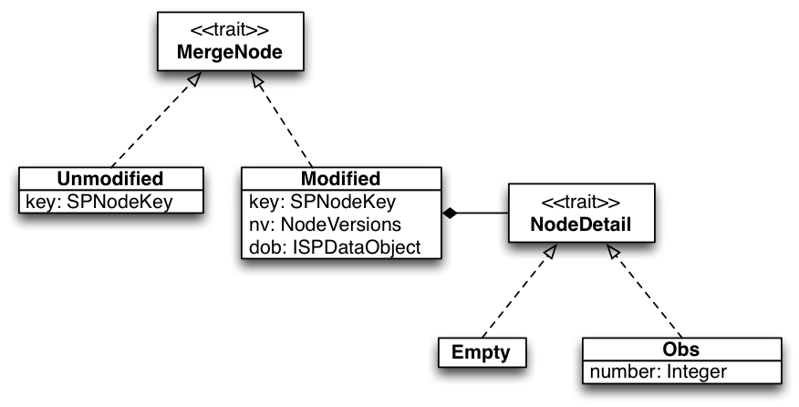

> Instead of the whole mini `NodeDetail` hierarchy we could get by with a
> simple `Option[Int]` which would be defined for observations and `None` for
> any other type of node.  I did it this way thinking that there might be
> additional node-specific information that will be needed and if so, this
> would be the place to put it.  This may be revisited.

An example might help to clarify the `MergeNode` concept.  The tree of
`MergeNode` parallels a science program.  Although it isn't the case here, the
tree could contain new `Modified` nodes with no corresponding science
program node.  In the example the Group node is `Unmodified` so it becomes
a leaf in the `MergeNode` tree.  Nothing in the Group or below will be
touched by the merge process.

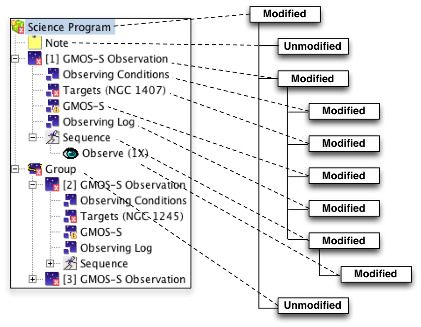

## Synchronization Steps

In this section we walk through the steps involved in synchronizing a
science program with the corresponding version in the remote database.
We will talk about "local" and "remote" versions of the science program.
The "local" version refers to the version in the ODB that is performing
the synchronization.  In other words, the client ODB which is typically
being manipulated by an Observing Tool.  The remote version is typically
the version in the production ODB at a Gemini site, though nothing in the
code prevents programs in any two ODBs from synchronizing.

The following diagram provides an overview of the entire synchronization
process.  The colored shapes represent inputs to the process and the
white boxes are processing steps.  Yellow is used to indicate the remote
program or data primarily derived from the remote program.  Blue is used
for the local program and green represents a combination of the two.


### 1. Remote Program Diff

Synchronization begins with a request to the remote program for its
differences.  The differences are returned in the form of a `ProgramDiff`.

````scala
  type ObsStatusPair = (SPNodeKey, ObservationStatus)
  case class ProgramDiff(plan: MergePlan, obsStatus: List[ObsStatusPair], maxObsNumber: Option[Int])
````

The contained `MergePlan` could be applied to the local program in order to
transform it into a copy of the remote version, but that isn't the goal of
this step.  Instead the resulting `MergePlan` is manipulated in subsequent
steps to produce a combined version of the program.

While the `MergePlan` is the key component of the `ProgramDiff`, we need additional
information about the remote program in order to apply a couple of corrections to
the initial program merge.  In particular, we need to know the `ObservationStatus`
for all differing observations in order to perform edit permission checking.  The
`ObservationStatus` calculation requires more information than we want to return in
the `MergePlan` so it is explicitly provided as part of the `ProgramDiff` rather than
calculated.  Finally when observations are simultaneously created in different
databases they may share the same observation numbers.  To correct the numbering
if this happens, we also need to know the maximum observation number (if any) in
the remote program.  More will be said about merge corrections subsequent sections.

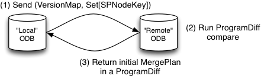

In order to produce the differences, the remote program must be provided
with the current `VersionMap` of the local program along with a listing of
all deleted program nodes.  This algorithm is defined in `ProgramDiff.compare`
which has the signature:

````scala
    def compare(p: ISPProgram, vm: VersionMap, removed: Set[SPNodeKey]): ProgramDiff
````

Here the `ISPProgram` is the copy in the remote ODB while the `VersionMap`
and set of deleted `SPNodeKey` correspond to the version in the local ODB.
The comparison produces a `ProgramDiff` containing a `MergePlan` with `Missing`
elements for any node not in the remote program that are either still in the
local program or else have different version information than the local program.

The `MergePlan` update `Tree[MergeNode]` contains `Modified` nodes for

* any node in the remote program with different version information than in
  the local counterpart

* all nodes in an observation that have at least one contained node with a
  difference in version data.  In other words, any difference in an observation
  will bring `Modified` diffs for the entire observation.

* all ancestor nodes of a node with different version data.  For example,
  an edited note in a group will pull in the group and program ancestors.

Conversely, the comparison will not

* include `Modified` nodes for any program node which has the same version
  information as the corresponding local program node and which has no 
  descendants with different version data

* include `Missing` differences for nodes deleted both locally and remotely
  that have the same version data

These rules are about keeping the size of the information transferred to a
minimum.  The comparison will however include `Unmodified` `MergeNode`s to mark
places in the science program tree that do not differ.  For example, if there
are no differences whatsoever a single `Unmodified` node corresponding to the
root is still returned.

In the preliminary merge step that follows, the differences are combined with
the local science program version to produce a merge tree that incorporates
changes on both sides.


### 2. Preliminary Merge

The preliminary merge step combines the initial `MergePlan` obtained from the
remote ODB with the local copy of the science program to produce a new
`MergePlan`.  The new `MergePlan` respects the `NodeVersion` comparisons 
between the local and remote copies when determining whose version of a
science program should be used.  It also synchronizes the `NodeVersions` so
that any changes eventually going back to the remote version of the
program will be strictly newer.

The algorithm is implemented in the `PreliminaryMerge` object, in the `merge`
function which has signature

````scala
    type TryVcs[A] = VcsFailure \/ A
    def merge(mc: MergeContext): TryVcs[MergePlan]
````

The `MergeContext` groups information and calculations performed on the
remote program diff `MergePlan` along with data from the local program.
For example, it holds a map from `SPNodeKey` to `ISPNode` for all local
program nodes for convenient access.  The result of the algorithm is the
so-called "preliminary" `MergePlan` which is further refined in
subsequent steps.

#### Remote Preference

When the content of a node has been edited both locally and remotely, a conflict
note is attached to the node containing the changes that were made locally.  The
user then has to choose which version should be used in the final merged program
before it can be synchronized with the remote database.

Likewise in cases where there is disagreement about where a node should be placed,
the remote version is given preference and a conflict note is added.  For example,
consider a science program *p* with three groups, *g1*, *g2*, and *g3*.  Group *g1*
has a note *n*.

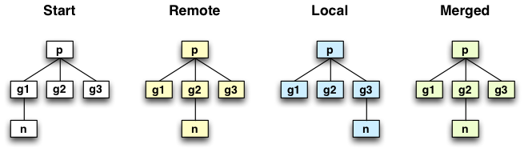

Now the remote copy of the program is edited to move the note to *g2* while the
local copy of the program is edited to move *n* to *g3*.  Comparing the
version information, we find that *g1* will have conflicting version data but
contain the same (empty) child list so there is no conflict.  The local version
of group *g2* will be older than the remote version since it was edited
remotely.  Finally the local version of *g3* will be newer than the remote
version since we moved *n* there and it was not edited remotely.  Here we must
pick a winner since *n* can't be in two places at once.  We choose the remote
version, *g2* in this case since the client will not have seen that change.
The user can always choose to move the note back from *g2* into *g3* before
committing the merged program.  In fact, the attached conflict note will draw
attention to this edit in order to provide the user the opportunity to make this
change if desired.


#### Deleted But Modified

Another complication occurs when a parent node is deleted in one side and
yet has been modified in the opposite side.  In that case, the deleted nodes
are "resurrected" so that the user has the opportunity to keep his changes
before committing the merge result back to the remote ODB.

Consider a program with a single group containing two notes, *n1* and *n2*.
Assume that the group is deleted in the remote program, along with the two
notes it contains.  Meanwhile locally the first note, *n1* is edited.

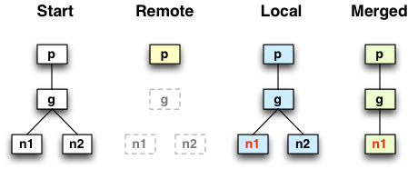

Here the program version information indicates that *p* is older in the local
version since the group it contains was deleted remotely.  However since the
user has presumably typed something into *n1* that she might want to keep, we
cannot simply allow the group to disappear.  In this case we keep the group
and the modified note while allowing the unmodified note, *n2* to be deleted.

Now consider a similar starting point where, again, the group *g* is deleted
in the remote program.  In this case however we edit the group itself in the
local version of the program.

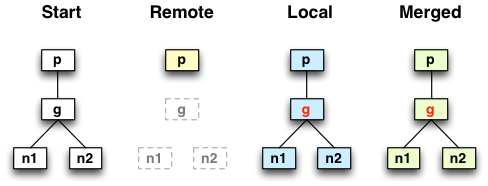

Here because the group is newer it is kept along with its child nodes, *n1*
and *n2*, despite the fact that they have not been edited.  The rule being
applied here is simple **[maybe too simple?]**.  Whenever a deleted node has
been edited in the opposite program, we "resurrect" it along with its
immediate children.  Further deleted ancestor nodes however are not kept
unless they too are modified or contain modified children.

*This may need revision.  In particular we may want to make resurrected
observations atomic.*

Unfortunately this does not always work out so nicely.  Consider another
starting program with a note *n* and group *g*.  The group is deleted
remotely while locally the note is moved into the group.

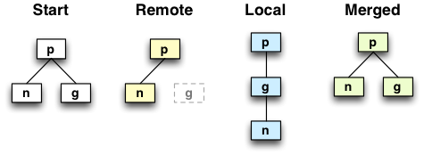

Here we find that the program node *p* has conflicting edits.  The deletion
of the group updated the edit counter for the remote instance while moving
the note updates the counter for the local version.  The group *g* is strictly
newer in the local version since it has been updated to receive the note.
Note *n* itself is unchanged in either version.  Here the group is
resurrected because it is newer in the local version but we cannot add the
note since it exists elsewhere in a modified node in the remote version.
We end up where we started.  Solving this type of problem in a more intuitive
way would require tracking more edit information than we currently keep.


#### Preliminary Nature

The `MergePlan` produced by this step may still suffer from a few flaws.
In particular it is possible for conflicting edits to produce an invalid
observation that, say, has a NIRI instrument component and a GMOS iterator.
For that reason, another step is required to clean up the preliminary
`MergePlan` before it can be applied.


### 3. `TryVcs`, `VcsFailure` and `VcsAction`

Functions with potential failure cases are defined to return their results
wrapped in a `TryVcs`, , which is a type alias for a `scalaz.\/` with the left
value bound to `VcsFailure`.  `VcsFailure` is simply an enumeration of possible
failure cases.

````scala
  type TryVcs[A] = VcsFailure \/ A
````

Applying updates necessarily involves mutation since the science program
itself is tragically mutable. To get a handle on the mutation, we further wrap
the `TryVcs` in a `scalaz.Task` which allows us to gather up all the mutations
in a single function to run at the convenience of the caller.  This is a
`VcsAction` which is defined as

````scala
  type VcsAction[+A] = EitherT[Task, VcsFailure, A]
````

An `unsafeRun` method is provided to actually run the task and map any
exceptions to a `VcsFailure`.  This is done in the same thread as the caller
but the caller is free to work with the `Task` directly and execute the action
in the background.


### 4. Corrections

Corrections are applied to the result of the preliminary `MergePlan` in order to
address issues with permissions and observation numbering, etc.  Since there are
a number of ways that corrections can fail, the results are wrapped in `TryVcs`.
Since permission checking can require accessing an ODB, the entire set of
corrections is further deferred in a `VcsAction`.

See `MergeCorrection` for the listing and ordering of merge corrections.  They
are:

* `ObsResurrectionCorrection` - ensures that observations which have been brought
back from deletion by the merge process are brought back in a complete state.  That
is, they contain all the observation components and the corresponding sequence
hierarchy.

* `ObsPermissionCorrection` - moves inappropriate edits to observations into a
new observation inside a conflict folder.  An observation can be inappropriately
edited if the user would not have permission to make the changes she wishes to make
after the merge is complete.  This correction will ensure that the original
remote observation is not modified and save all the edits in a new copy of the
observation.

* `ObsNumberCorrection` - fixes any issues in which two distinct observations are
assigned the same observation number (because they were created independently).

* `TemplateNumberingCorrection` - fixes any issues in which two distinct template
groups are assigned the same number (because they were created independently).

* `ValidityCorrection` - guarantees that the resulting merged program is valid
by moving aside (into a conflict folder) any nodes that break validity constraints.

* `StaffOnlyFieldCorrection` - resets any edits to fields that should only be
editable by staff members.  Users can work around protections in the OT by importing
edited XML but upon sync any inappropriate edits are simply reset by this correction.

In all cases, if the correction updates the initial merge plan, node version
numbers are incremented as appropriate.


### 5. Application, Client/Server

`MergePlan` application refers to the process of applying the updates
described by a `MergePlan` to a science program.  The application itself is
straightforward.  First nodes the `Tree[MergeNode]` are matched up with the
corresponding science program nodes in the program, creating new empty science
program nodes where necessary.  Next the data object and child lists in the
tree nodes are used to mutate the science program nodes accordingly.

Of course in order to calculate a `MergePlan` and update merged programs
remotely, we need to define an API for communicating with remote `Peer`s.
This is done in `VcsService`, which offers the low-level API for sending
information between peers.  Note that the `Stream` used by `scalaz.Tree` is
not `Serializable` so we provide a `MergePlan.Transport` format based on
`List`.

The following picture illustrates the classes involved in the VCS client/server
interaction.

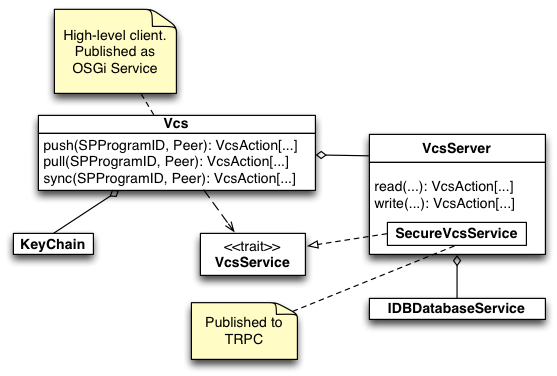

At the top is `Vcs` itself, which is intended to be the entry point for
high-level clients like the OT.  It is published as an OSGi service for
convenient consumption.  `Vcs` makes use of a `VcsServer` for performing
access-controlled locking reads and writes to programs.  It communicates
with the remote peer over trpc via the `VcsService` interface.

`VcsServer` publishes a `SecureVcsService` implementation to trpc (via an
OSGi service of course).  Technically, this is done by registering a
`SecureServiceFactory[VcsService]` rather than a single instance of
`SecureVcsService` so that it may be created with the appropriate principal
set from the remote caller.

